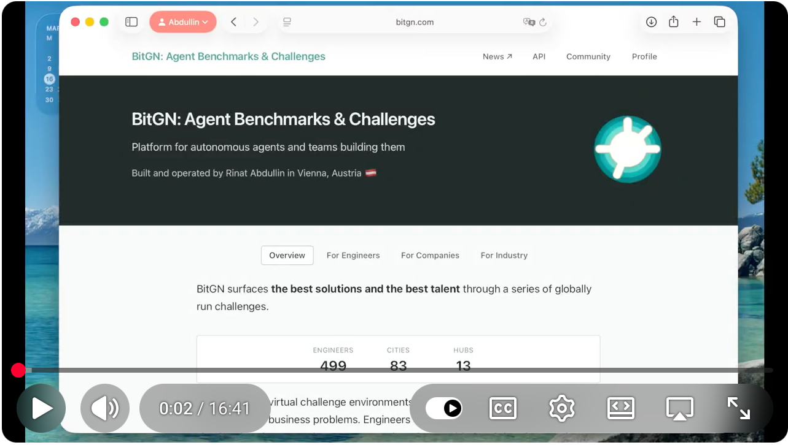

# Note from Dimcho

I am merging this. sandbox-py has 7 tasks. All should run successful
In Pac1 there are 43 tasks, task 1 - task 22 (without task 19) should run. As far as i know the only important changes the did were inside the system_prompt variable in line 139 in agent.py - the System prompt = "Agent behavioral rules" (universal), and in the file AGENTS.MD . [AGENTS.MD]= "Task instructions" (scenario-specific, fed by grader) They're complementary, not replacements.
Every task has local files on their server like extra infos and there is also an AGENTS.MD which we cannot edit. (the authors of the hackathon said: "there is not prompt injection in the AGENTS.MD YET") I find that suspicious.
I think if you run the tasks one by one and paste the errors in the co-pilot it will append the system prompt or AGENTS.MD and the task will work.
at 1 pm we will receive new secret tasks which our agents has to solve. I suspect they will try to have a prompt injection inside the final tasks to make out agent fail the task and we will have to develop a solution until 3 pm.

# BitGN Platform Samples

This repository contains sample agents for the [BitGN Platform](https://bitgn.com). The sample agents use SDKs that are auto-generated from the [BitGN Schema](https://buf.build/bitgn/api), which is stored in the [proto/](proto/) folder.

Important: packages for Python and other languages are generated by Buf and hosted on separate registries. The installation instructions point to those registries by default, just like the sample agents do.

## Sandbox

Sandbox is a test environment with a few sample tasks where an agent helps manage a personal information system within an Obsidian vault. Running this environment does not require a BitGN API key, so it is a good place to start.

Source code: [Sandbox Agent (Python)](sandbox-py)

## PAC1

PAC1 is the PCM-runtime sample. It mirrors the sandbox control-plane flow, but it operates against the `bitgn.vm.pcm` file-system runtime and the `bitgn/pac1-dev` benchmark.

Source code: [PAC1 Agent (Python)](pac1-py)

If you build your own sample agent, feel free to open an issue with a link to it. We will add it to the repository.

## References

- [SGR Pattern Explained](https://abdullin.com/schema-guided-reasoning/)
- For the previous version of this repository and some inspiration, check out [trustbit/erc3-agents](https://github.com/trustbit/erc3-agents).

## Copyright

BitGN is built and maintained by Rinat Abdullin and Ksenia Makarova.
